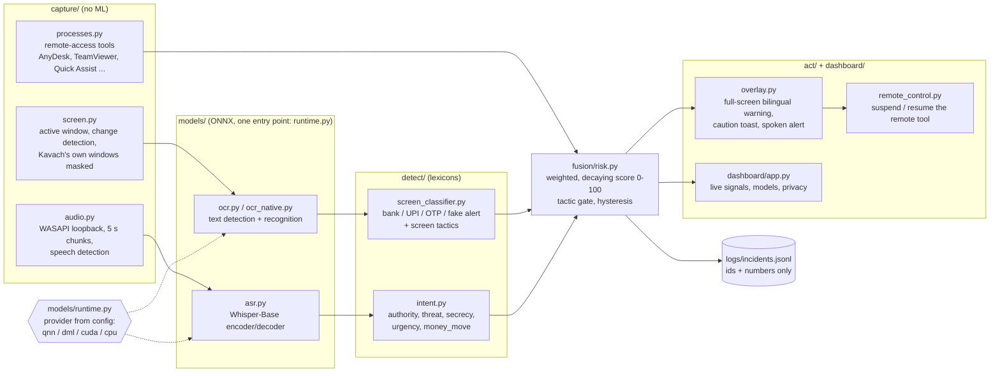

# Kavach

Kavach is an offline, on-device scam shield for Windows PCs, built for the Snapdragon AI Lab challenge.
It watches for remote-access tools, reads the active window with OCR and listens to call audio, then fuses these
signals into a risk score. A high score raises a full-screen warning. Nothing leaves the PC.

## Contents

1. [Architecture](#architecture)
2. [Install on Windows x64 (dev)](#install-on-windows-x64-dev)
3. [Install on Snapdragon X (target)](#install-on-snapdragon-x-target), prepared, not yet run on a device
4. [Run Kavach](#run-kavach)
5. [Demo](#demo)
6. [Scenario harness](#scenario-harness)
7. [AI Hub benchmark](#ai-hub-benchmark)
8. [Benchmark table](#benchmark-table)
9. [Privacy guarantees and how to verify them](#privacy-guarantees-and-how-to-verify-them)
10. [Known limitations](#known-limitations)
11. [Repository layout and tests](#repository-layout-and-tests)

## Architecture

The pipeline is capture -> models -> detect -> fusion -> act. Each stage runs in its own thread. Only labels,
tactic ids, scores and timestamps pass between stages. Frames, OCR text, transcripts and audio stay in RAM inside
the stage that produced them.



| Signal (config `fusion.signals`) | Points | Held for |
|---|---|---|
| remote tool live (user process) | 30 | while it runs |
| money screen (bank / UPI) | 25 | 120 s |
| OTP / card entry on screen | 20 | 120 s |
| fake-alert page | 20 | 120 s |
| scam tactic on screen | 15 each, cap 30 | 120 s |
| scam tactic in the call | 13 each, cap 65 | 180 s |
| combo: remote + money screen + any tactic | 20 | while active |

The bands are caution at 50 and alert at 70. Two design rules shape the score:
- **Tactic gate:** without a tactic or a fake-alert page, the score is capped at 69. A genuine IT helper on AnyDesk
  while a bank page is open is therefore a caution, not an alert.
- **A call alone can reach caution but never alert.** Its cap is 65.

Every ONNX model is loaded through `models/runtime.py`, and the execution provider comes only from config. The one
exception is the third-party rapidocr backend.

## Install on Windows x64 (dev)

You need Windows 10/11 x64 and Python 3.11 (`py -3.11`).

```powershell
powershell -ExecutionPolicy Bypass -File scripts\setup_dev.ps1   # .venv, requirements, then onnxruntime-directml last
.\.venv\Scripts\Activate.ps1
python -m models.runtime --info        # expect DmlExecutionProvider + CPUExecutionProvider
python -m pytest -q
```

Only one onnxruntime build may be installed at a time. `rapidocr_onnxruntime` pulls in plain `onnxruntime`, so the
setup script removes every onnxruntime package and installs `onnxruntime-directml` last.

`onnx` is pinned to 1.18.0 because Windows Smart App Control blocks newer unsigned wheels on the dev PC.

The model weights go in `weights/`, which is gitignored:

```powershell
python scripts\fetch_ocr_models.py       # OCR det/rec/keys from the rapidocr package
python scripts\fix_ocr_shapes.py         # static-shape det + rec buckets for the native / NPU backend
# Whisper export needs a separate venv (torch never enters .venv):
py -3.11 -m venv .venv-aihub
.\.venv-aihub\Scripts\python.exe -m pip install "qai-hub-models[whisper-base]"
.\.venv-aihub\Scripts\python.exe scripts\export_whisper.py --model whisper_base
```

## Install on Snapdragon X (target)

> **Status: prepared, not yet run on a Snapdragon device.** The NPU models were compiled and profiled on AI Hub's
> hosted Snapdragon X Elite. The install below was checked against PyPI only. The QNN plugin code path in
> `models/runtime.py` is covered by unit tests with a faked onnxruntime.

1. **Python.** Install native ARM64 Python 3.11 (the python.org "Windows installer (ARM64)"; afterwards
   `py -3.11-arm64` works).
2. **onnxruntime.** Install plain `onnxruntime==1.24.4` plus the plugin execution provider `onnxruntime-qnn==2.6.0`.
   - The plugin bundles QAIRT/QNN **2.50.40**, the same QAIRT line (v2.50) AI Hub used to compile the models.
   - `onnxruntime-qnn` 1.24.4 is an all-in-one build with QNN 2.42, older than the compile, so it is not used.
   - `models/runtime.py` registers the plugin and attaches it to the NPU device.
3. **Models.** Copy `weights/qnn/` (the AI Hub compiled models) and `weights/ocr/keys.txt` from the dev PC, or run
   `python scripts\fetch_qnn_models.py` (needs `qai-hub configure --api_token ...`).
   `weights/qnn/manifest.json` records the source compile job ids and the sha256 of every file.

```powershell
py -3.11-arm64 -m venv .venv
.\.venv\Scripts\python.exe -m pip install -r requirements-snapdragon.txt
.\.venv\Scripts\python.exe scripts\fetch_qnn_models.py --check       # files match the manifest
.\.venv\Scripts\python.exe -m models.runtime --info                  # expect QNNExecutionProvider
.\.venv\Scripts\python.exe main.py --config config.snapdragon.yaml
```

`config.snapdragon.yaml` extends `config.yaml` and makes these changes:
- provider `qnn`, `backend_path: QnnHtp.dll`, burst mode, fp16
- native OCR and Whisper pointed at `weights/qnn/`
- `fallback_to_cpu: false`

The last setting is strict on purpose. If `QNNExecutionProvider` or a compiled model is missing, Kavach refuses to
start instead of running on the CPU. ORT is also barred from placing single operators on the CPU
(`session.disable_cpu_ep_fallback`). On a PC without QNN (like the dev PC):

```text
> python main.py --config config.snapdragon.yaml
Kavach cannot start: runtime.provider is 'qnn' (QNNExecutionProvider) with fallback_to_cpu: false, but this
onnxruntime (onnxruntime-directml==1.24.4, AMD64) only has ['DmlExecutionProvider', 'CPUExecutionProvider'].
Refusing to start rather than run on the CPU. Fix: install onnxruntime-qnn on native ARM64 Python 3.11 on a
Snapdragon X PC (requirements-snapdragon.txt), or use a config with a provider available here (config.yaml).
(exit code 2)
```

**ARM64 wheel availability.** This is `python scripts\check_arm64_wheels.py` run against PyPI for cp311 win_arm64:

| Package | Pinned | win_arm64 wheel | Fallback if missing |
|---|---|---|---|
| onnxruntime | 1.24.4 | yes | - |
| onnxruntime-qnn | 2.6.0 | yes (plugin EP, QAIRT 2.50.40) | - |
| numpy | 2.4.6 | yes | - |
| psutil | 7.2.2 | yes | - |
| pywin32 | 312 | yes | - |
| pillow | 12.3.0 | yes | - |
| rapidfuzz | 3.14.6 | yes | - |
| mss | 10.2.0 | pure Python | - |
| PyYAML | 6.0.3 | sdist only | builds as pure Python without libyaml (verify on device) |
| opencv-python | 5.0.0.93 | **no** (no OpenCV variant has one) | port the resize / contour / warp calls to numpy + Pillow + scikit-image 0.26.0 (win_arm64 wheel), or build OpenCV with the MSVC ARM64 toolchain |
| shapely | 2.1.2 | **no** (sdist, needs GEOS) | numpy area + perimeter (only `Polygon.area` / `.length` are used) |
| pyclipper | 1.4.0 | **no** (sdist, C++) | build with VS Build Tools ARM64, or offset the 4-point box in numpy |
| soxr | 1.1.0 | **no** (sdist, CMake) | `scipy.signal.resample_poly` (scipy 1.17.1 has a win_arm64 wheel) |
| PyAudioWPatch | 0.2.12.8 | **no** (no ARM64 wheel, no sdist) | `soundcard` 0.4.6 (pure Python over cffi 2.1.1, which has a win_arm64 wheel) for WASAPI loopback |

Tk ships with the python.org ARM64 installer. `rapidocr_onnxruntime`, `onnx` and `qai-hub` are not needed on the
device.

## Run Kavach

```powershell
python main.py                           # pipeline + alert overlay + live dashboard; close the dashboard to quit
python main.py --no-dashboard            # overlay only
python main.py --plain                   # headless: one status line per second, no windows
python main.py --provider cpu            # override runtime.provider (qnn | dml | cuda | cpu)
python main.py --config config.snapdragon.yaml
python main.py --seconds 60 --screenshot demo\screenshots\dashboard.png   # timed run + dashboard PNG (UI only)
```

Every module has a self-test, for example `python -m capture.processes --once`, `python -m capture.audio --meter`,
`python -m detect.intent`, `python -m fusion.risk` and `python -m dashboard.app --demo`.

The config is `config.yaml`. The environment overrides are `KAVACH_CONFIG` (an alternate file) and
`KAVACH_PROVIDER`.

## Demo

This is the "CBI digital arrest" hero scenario. Every page and call script is fictional and labelled DEMO.

```powershell
python main.py --dashboard-topmost
# 1. start a remote-access tool: AnyDesk, or add notepad.exe to processes.extra_exe_names and open Notepad
# 2. open demo\test_pages\mock_bank_transfer.html in the browser, maximized
python scripts\play_scenario.py          # speaks demo\scripts\hero_call.txt through the speakers (SAPI)
```

Within seconds of the first scam phrase ("CBI cyber cell"), the score reaches 100. Kavach then raises the
full-screen warning and writes one alert line to `logs/incidents.jsonl`. In the warning:
- **"Stop and get help"** suspends the live remote tool and shows the helpline.
- **"I'm safe, continue"** resumes anything suspended and silences repeat alerts for 10 minutes, unless a new kind
  of signal appears.

The other pages are in `demo/test_pages/`: fake KYC, fake virus alert, fake electricity bill, UPI collect request,
shopping checkout, news article and email. The other call scripts are in `demo/scripts/` and include a Hinglish
hero variant.

## Scenario harness

`bench/scenarios.py` runs the TRD's 20 scenarios (10 scam, 10 normal) end to end on the real pipeline. For each
scenario it:
- opens the demo page in its own browser window and keeps it in front
- starts the (fake) remote tool
- speaks the call script, which WASAPI loopback hears
- records max score, band, alert / caution and time to alert

```powershell
python -m bench.scenarios --dry-run                        # validate the spec + assets, print the plan
python -m bench.scenarios                                  # all 20 live, about 25 min (desktop + speakers in use)
python -m bench.scenarios --only upi_collect,work_call     # re-run some; other rows are kept
python -m bench.scenarios --only news_audio_bank --repeat 3
python -m bench.scenarios --replay                         # re-score recorded runs, no hardware
python -m bench.scenarios --compare bench\tuning\x.yaml    # before/after for all 20 -> bench/results/tuning.md
python -m bench.scenarios --report                         # rewrite scenarios.md/.csv
```

Current results are in [`bench/results/scenarios.md`](bench/results/scenarios.md). The `source` column says
whether a row was measured live under the current config or replayed from its recorded signals.

| Metric | Result | Target |
|---|---|---|
| Scams caught | 10/10 (9 alerts; the call-only KYC scam reaches caution, as designed) | >= 90% |
| False alarms among 10 normal scenarios | 0 alerts, 0 false cautions | 0 alerts, <= 1 caution |
| Time to alert (scam phrase spoken / page shown -> alert) | p50 2.0 s, p95 4.2 s | p95 <= 5 s |
| Trigger -> fusion decision | p50 0.60 s, p95 0.70 s | - |

Tuning changes config weights only, never scenario-specific code. The runs record derived signals (labels, tactic
ids, timestamps; no text), so `--compare` shows the effect of a weight change on all 20 scenarios.

## AI Hub benchmark

These are dev-time tools; the Kavach runtime never talks to AI Hub. The token is set once with
`qai-hub configure --api_token <token>` and stays in `%USERPROFILE%\.qai_hub\client.ini`, outside the repo.

```powershell
python -m bench.aihub_profile --list-devices
python -m bench.aihub_profile --submit ocr [--inference-check]   # compile + profile det/rec buckets for the NPU
.\.venv-aihub\Scripts\python.exe scripts\export_whisper.py --model whisper_base --skip-onnx --aihub
python -m bench.aihub_profile --status                           # advance compile -> profile / inference jobs
python -m bench.aihub_profile --collect                          # download profiles -> bench/results/aihub_results.json
python -m bench.local_bench                                      # local CPU + DirectML runs -> benchmark_table.md
python scripts\fetch_qnn_models.py                               # compiled NPU models -> weights/qnn/ + manifest.json
```

Job ids are logged in `bench/results/aihub_jobs.json`. Only model weights and synthetic inputs are uploaded, never
screen or audio data.

## Benchmark table

This is from [`bench/results/benchmark_table.md`](bench/results/benchmark_table.md), generated 2026-09-29 by
`python -m bench.local_bench` with 50 timed runs after 5 warm-up runs and synthetic inputs.
- **Local cells** are p50 / p95 ms.
- **Snapdragon NPU cells** are the AI Hub profiler's estimated inference time on a hosted Snapdragon X Elite CRD
  (ONNX Runtime 1.27.1, QAIRT v2.50, `precompiled_qnn_onnx`).
- **Dev PC:** AMD Ryzen 7 7735HS (CPU), and an RTX 4050 Laptop GPU through DirectML.

| Model | Snapdragon NPU (AI Hub) | Dev CPU | RTX 4050 (DirectML) | NPU / GPU / CPU ops | Peak memory (AI Hub) |
|---|---|---|---|---|---|
| OCR det (1x3x736x1280) | 14.1 | 128.2 / 150.5 | 16.9 / 17.5 | 201 / 0 / 0 | 53.3 MB |
| OCR rec, batch 8x3x48x320 | 32.4 | 76.8 / 90.0 | 12.2 / 13.0 | 228 / 0 / 0 | 62.2 MB |
| OCR rec, batch 8x3x48x640 | 64.2 | 294.2 / 338.6 | 27.1 / 27.6 | 228 / 0 / 0 | 97.2 MB |
| OCR rec, batch 4x3x48x1280 | 107.0 | 279.3 / 382.7 | 27.0 / 28.0 | 228 / 0 / 0 | 97.2 MB |
| Whisper-Base encoder (1x80x3000 = 30 s) | 45.9 | 437.5 / 778.0 | 50.0 / 51.8 | 556 / 0 / 0 | 95.0 MB |
| Whisper-Base decoder, 1 step (200-slot KV cache) | 3.6 | 14.3 / 14.7 | 11.4 / 23.4 | 975 / 0 / 0 | 174.2 MB |

| End to end | Snapdragon NPU (AI Hub) | Dev CPU | RTX 4050 (DirectML) |
|---|---|---|---|
| OCR full frame, 1280x720 (native backend) | not measured end to end on a device | 757.3 / 888.3 | 91.2 / 94.1 |
| Whisper-Base per 5 s chunk (encoder + 20 decoder steps) | 117.1 (computed from AI Hub parts) | 723.1 (computed) | 278.0 (computed) |

Every model runs entirely on the NPU: 0 GPU and 0 CPU ops in the AI Hub profiles. The rapidocr backend uses
dynamic shapes and cannot be compiled for the NPU; the native backend is the NPU path.

## Privacy guarantees and how to verify them

**Guarantees:**
1. **No network.** The runtime code opens no connections. The only network code is in the dev-time tools
   (`bench/aihub_profile.py`, `scripts/fetch_qnn_models.py`, `scripts/check_arm64_wheels.py`, `scripts/export_whisper.py`).
2. **No raw data on disk.**
   - Screenshots, OCR text, transcripts and audio live in RAM only.
   - `privacy.write_raw_to_disk` must be `false`; the config loader refuses to start otherwise.
   - Logs and printed output carry labels, ids, scores and latencies only. Window titles show as
     `<title hidden>` and command lines as exe + flag names, unless `privacy.debug_show_text: true`.
3. **Incident log with derived data only.** `logs/incidents.jsonl` gets one line per caution / alert /
   warning-shown / override. It holds time, kind, score, band, reason ids and latencies, never text, titles, images
   or audio. Reason ids are re-checked against a strict pattern before writing:

```json
{"time": "2026-09-29T23:35:54.796", "ts": 1790705154.797, "kind": "alert", "incident": 1, "score": 100, "band": "alert", "reason_ids": ["call:authority", "combo", "remote_tool:anydesk"], "decision_ms": 840.0}
```

**How to verify:**

```powershell
python scripts\verify_privacy.py --seconds 60   # play the demo meanwhile to exercise OCR, ASR and the log
```

This runs the real pipeline headless and checks three things:
- the Kavach process tree's TCP/UDP sockets, polled every 0.5 s: must stay 0
- files created or changed under the repo and `%TEMP%` during the run: only `logs/incidents.jsonl` is allowed, and
  no image/audio/text files
- every incident-log line: allowed keys only, and reason ids that match the pattern

Result on the dev PC:

```text
1. network: 0 socket(s) seen in 71 polls of the Kavach process tree -> OK (0)
2. disk: repo files changed during the run: none; image/audio/text files created under repo or %TEMP%: 0 -> OK
3. incident log: 0 line(s) written during the run, 0 problem(s) -> OK
```

Independent checks:
- The dashboard's Privacy card shows the live count of network connections opened by Kavach, which must stay 0.
- `Get-NetTCPConnection -OwningProcess <pid>` shows the same from outside Kavach.
- Sysinternals Process Monitor, filtered on the Kavach PID, shows every file write.
- `tests/test_privacy.py` covers redaction; `tests/test_pipeline.py` and `tests/test_overlay.py` cover the
  incident-log format.

## Known limitations

- **English ASR for the MVP.** Whisper runs with `language: en`. Hinglish scam phrases are matched through
  romanised patterns in the lexicon, but Hindi speech itself is not transcribed. Devanagari lexicon entries are
  prepared but empty.
- **Power is not measured.** There are no energy or battery numbers on any device.
- **The NPU path was profiled on AI Hub hosted devices, not run end to end on a local Snapdragon.**
  - The per-model latencies are AI Hub profiler estimates.
  - Full-frame OCR and full ASR on the NPU are computed from those parts, not measured.
  - The Snapdragon install (`requirements-snapdragon.txt`, `config.snapdragon.yaml`, the QNN plugin code path) is
    prepared but has not run on ARM64 hardware.
- **Five dependencies have no win_arm64 wheel:** OpenCV, shapely, pyclipper, soxr and PyAudioWPatch. Kavach needs
  the listed fallbacks before it can run natively on Snapdragon.
- **The scenario harness uses synthetic stand-ins.**
  - Calls are SAPI text-to-speech voices (Zira), not real phone audio.
  - Remote access is a stand-in `waitfor.exe`, because AnyDesk is not installed on the dev PC.
  - 16 of the 20 rows are replays of earlier live runs under the final config.
  - The headless harness does not include the time to draw the warning window.
- **Real AnyDesk, tested once** (portable AnyDesk from Downloads, controlled from a phone, 2026-09-30):
  - Detection worked: AnyDesk open made `remote_tool` live.
  - A session is recognised by AnyDesk's `--backend` process. AnyDesk keeps a connection to its own servers even
    when idle, so a network connection can't mark a session.
  - The alert fired at score 82; the bank page was not in front for that run.
  - "Stop and get help" paused AnyDesk's network and UI processes, and the phone froze.
    - AnyDesk's `--backend` process refuses suspension (access denied), so it is not paused directly.
    - While paused, the phone link drops after about 1 minute; after "Resume remote app" the phone has to reconnect.
  - The installed (Windows service) version of AnyDesk has not been tested.
- **Detection limits:**
  - Only the active window is read.
  - A call alone (nothing on screen, no remote tool) can reach caution but never alert.
  - When the very first sentence of a news clip is cut at a chunk boundary before any reporting language, it can
    still count as one call tactic.

## Repository layout and tests

```text
capture/     processes.py, screen.py, audio.py         (no ML)
models/      runtime.py (the only ONNX entry point), ocr.py, ocr_native.py, asr.py
detect/      screen_classifier.py, intent.py, tactic_lexicon.py, lexicons/*.yaml
fusion/      risk.py (score, bands, gate), incidents.py (incident log)
act/         overlay.py (warning + toast), remote_control.py, strings.yaml (English / Hindi)
dashboard/   app.py
kavach/      pipeline.py (threads + fusion loop)
bench/       scenarios.py + scenarios.yaml, aihub_profile.py, local_bench.py, tuning/, results/
scripts/     setup_dev.ps1, model export/fetch, play_scenario.py, verify_privacy.py, check_arm64_wheels.py
demo/        test_pages/ (fictional DEMO pages), scripts/ (fictional call scripts), screenshots/
weights/     models (gitignored): ocr/, asr/, qnn/ (AI Hub compiled, manifest.json)
config.yaml, config.snapdragon.yaml, requirements.txt, requirements-snapdragon.txt, main.py
```

```powershell
python -m pytest -q        # runs without real models or Windows-only hardware where possible
```

See `CLAUDE.md` for the project rules (privacy, one ONNX entry point, provider from config only).
